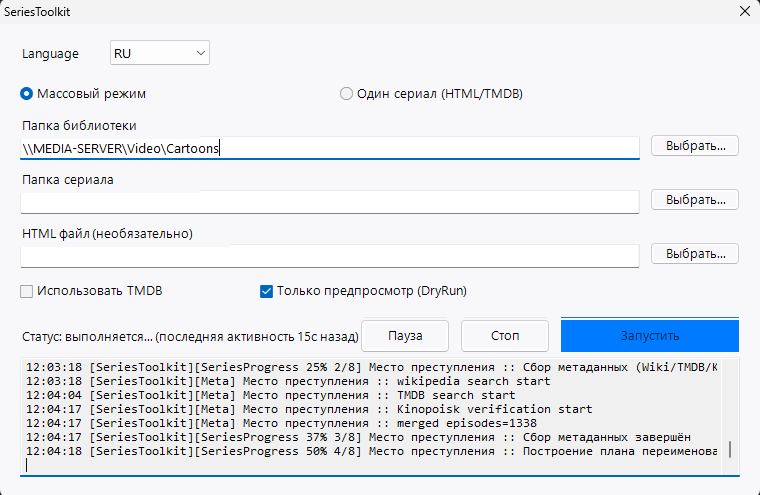
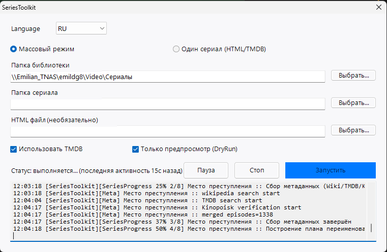

# SeriesToolkit

**SeriesToolkit** — это «одна папка — один инструмент» для навода порядка в библиотеках **сериалов и мультсериалов**.
Это основной и актуальный релиз проекта: здесь текущий движок, GUI, сборка EXE и документация.

## Зачем это нужно (по-человечески)

- В папках бардак: «Сезон 1», `Season 01`, файлы лежат не там.
- Имена файлов не совпадают с тем, как вы ищете серии.
- Хочется **сначала посмотреть план** (dry-run), потом один раз применить.
- Нужны **русские названия эпизодов**, где они вообще существуют в открытых источниках.

SeriesToolkit как раз это делает и пишет подробный **CSV-лог**, чтобы ничего не потерять.

## Быстрые ссылки для тестеров (без git)

| Что скачать | Прямая ссылка |
|-------------|----------------|
| **Архив всего проекта** (ветка `master`) | [SeriesToolkit-master.zip](https://github.com/emildg8/SeriesToolkit/archive/refs/heads/master.zip) |
| **Только launcher** (скрипт; положите рядом остальные файлы из ZIP) | [SeriesToolkit.ps1 (raw)](https://raw.githubusercontent.com/emildg8/SeriesToolkit/master/SeriesToolkit.ps1) |
| **Сборки / стабильные ZIP** | [Releases](https://github.com/emildg8/SeriesToolkit/releases/latest) |

После скачивания ZIP распакуйте в любую папку, рядом должен остаться родительский **`Fetch-VideoMetadata.ps1`** (в архиве он в корне пакета, если синхронизация с родительским репозиторием настроена — см. `Sync-GitHub.ps1`).

## Как это выглядит (GUI)

Актуальные скриншоты интерфейса:




Как сделать **настоящие** скриншоты у себя — пошагово: [docs/SCREENSHOTS-RU.md](docs/SCREENSHOTS-RU.md).

## Вложенные папки («сага» → отдельные сериалы)

Если структура такая:

```text
Сериалы\
  Звёздные войны\
    Войны клонов\     ← отдельный сериал
      Сезон 1\ ...
    Повстанцы\        ← другой сериал
```

то toolkit **не склеивает** «Звёздные войны» в один сериал: он обходит контейнер и обрабатывает **каждую внутреннюю папку**, которая выглядит как отдельное шоу (есть видео или папки сезонов). Если в корне контейнера лежат сами видеофайлы, контейнер считается **одним** сериалом — как раньше.

## Недостающие сезоны на диске

Если в метаданных (TMDB и др.) есть **сезон 3**, а на диске папки нет, при включённой настройке (по умолчанию **да**):

- создаётся папка сезона;
- внутри — служебный маркер `.series-toolkit-scaffold` и короткая подсказка;
- в **корне сериала** пишется **`SeriesToolkit-episode-index.csv`** — полный список эпизодов из базы, чтобы быстрее ориентироваться при следующей докачке.

Отключить можно в `SeriesToolkit.settings.json`: `create_missing_season_folders`, `write_episode_index_csv`.

## Что делает toolkit

- Приводит имена папок сезонов к одному шаблону (по умолчанию `Сезон N`).
- Строит безопасный план переименований и перемещений, снимает коллизии.
- Подтягивает названия эпизодов (HTML вручную, ru.wikipedia, Кинопоиск при доступе, TMDB `ru-RU`; опционально латиница для заглушек — см. настройки).
- Удаляет **пустые** папки после работы (папки-заготовки с маркером не пустые).

## Режимы

- **Batch** — вся библиотека по `RootPath`.
- **Manual** — один сериал + опционально локальный HTML со списком серий.

## Запуск из PowerShell

**Пробный прогон (ничего не меняет на диске):**

```powershell
powershell -NoProfile -ExecutionPolicy Bypass -File .\SeriesToolkit.ps1 -Mode Batch -RootPath "\\сервер\шара\Сериалы" -DryRun
```

**Боевой:**

```powershell
powershell -NoProfile -ExecutionPolicy Bypass -File .\SeriesToolkit.ps1 -Mode Batch -RootPath "\\сервер\шара\Сериалы" -Apply -UseTmdb
```

## GUI

```powershell
powershell -NoProfile -ExecutionPolicy Bypass -File .\Start-SeriesToolkitGui.ps1
```

Во время работы GUI теперь показывает:
- общий прогресс библиотеки: `LibraryProgress % (i/N)`;
- прогресс текущего сериала: `SeriesProgress % (этап/всего)`;
- метрики времени: **время старта**, **сколько прошло**, **ETA (оценка завершения)**;
- отдельную визуальную общую шкалу процента выполнения библиотеки;
- «последняя активность Nс назад» (если долго нет новых строк — видно, что происходит тяжёлый этап);
- кнопки **Пауза / Продолжить**, **Пропуск** (текущий сериал) и **Стоп** без закрытия окна;
- при нажатии **Стоп** — корректный финальный статус «прервано пользователем» с краткой статистикой выполнения.

Служебные GUI-логи:
- `LOGS/gui-session-*.log` — события GUI (старт, кнопки, причины закрытия, ошибки);
- `LOGS/gui-progress-*.log` — поток прогресса от движка.

Для упаковки в один файл: `.\Build-SeriesToolkitExe.ps1` → `SeriesToolkit.GUI.exe`.  
У EXE и у окна во время выполнения используется иконка `assets/SeriesToolkit.icon.ico`; при сборке старый `SeriesToolkit.GUI.exe` автоматически ротируется в `.bak`.

**EXE пересобирается автоматически**, когда меняется **`SeriesToolkit.ps1`** и срабатывает инкремент версии (см. `Bump-Version.ps1`). Отключить пересборку: `-SkipAutoBuildExe` у launcher.

## Настройки и секреты

1. Скопируйте `SeriesToolkit.settings.example.json` → **`SeriesToolkit.settings.json`**.
2. Подробно: **`SeriesToolkit.settings.README.md`**.
3. Файл с ключами и cookie **не коммитьте** (см. корневой `.gitignore`).

## Версии, OLD и GitHub

- Версия в `version.json`.
- **Инкремент версии и снимок в `OLD/`** выполняются **только когда изменился файл `SeriesToolkit.ps1`** (хэш сравнивается с локальным `.launcher-content.sha256`, файл в `.gitignore`).
- После успешного bump по желанию пересобирается **EXE** (если установлен модуль `ps2exe`).
- `Sync-GitHub.ps1` публикует копию без секретов в репозиторий **emildg8/SeriesToolkit** и автоматически делает/обновляет GitHub Release `vX.Y.Z` с ZIP-архивом.

## Логи

Каталог `LOGS`: CSV по операциям и краткий TXT.

## Обратная связь

Репозиторий: [https://github.com/emildg8/SeriesToolkit](https://github.com/emildg8/SeriesToolkit)
