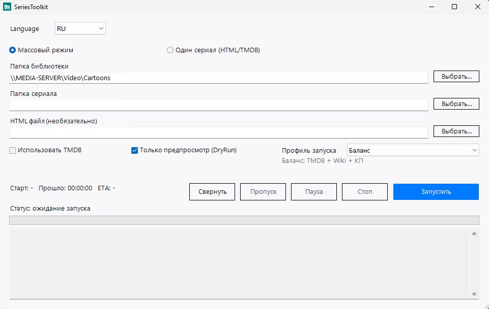

# Скриншоты для инструкции (сделайте у себя за 5 минут)

Ниже — что сфотографировать, чтобы получилась «живая» инструкция. Сохраняйте PNG в `docs/images/` и вставляйте в README при желании.

## 1. Окно GUI после запуска

1. Запустите: `Start-SeriesToolkitGui.ps1` или `SeriesToolkit.GUI.exe`.
2. Снимите окно целиком: видны поле «корень библиотеки», режим Batch/Manual, галочки DryRun/TMDB, выпадающий `Профиль запуска`.
3. Желательно, чтобы уже были видны кнопки `Свернуть`, `Пауза`, `Стоп` и строка статуса.
4. Для актуального вида делайте скрин на нормальном размере окна (не слишком маленьком), чтобы был читаем блок подсказки профиля.

**Имя файла:** `01-gui-main-v2.png` (актуальный: `docs/images/01-gui-main-v2.png`)

## 2. Cookie Кинопоиска (без секретов!)

1. Chrome → F12 → **Network**.
2. Обновите страницу Кинопоиска.
3. Снимите область **Request Headers**, но **замажьте** значение `cookie` (чёрная полоса) — в инструкции достаточно показать, *где* копировать.

**Имя файла:** `03-kp-network-headers-redacted.png`

## 3. Структура папки после работы

1. Проводник: корень сериала с `Сезон N` и примером переименованного файла.
2. При необходимости покажите созданный `SeriesToolkit-episode-index.csv`.

**Имя файла:** `04-library-result.png`

---

В README используется блок:

```markdown

```

после того как файлы появятся в репозитории.
